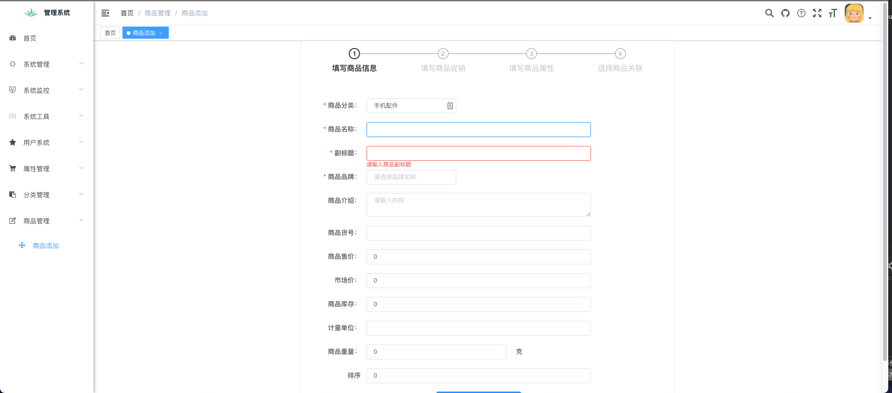
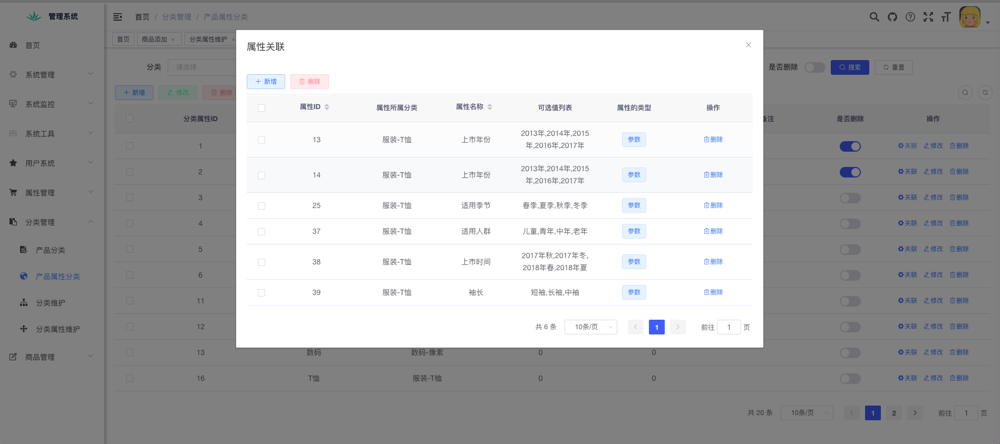
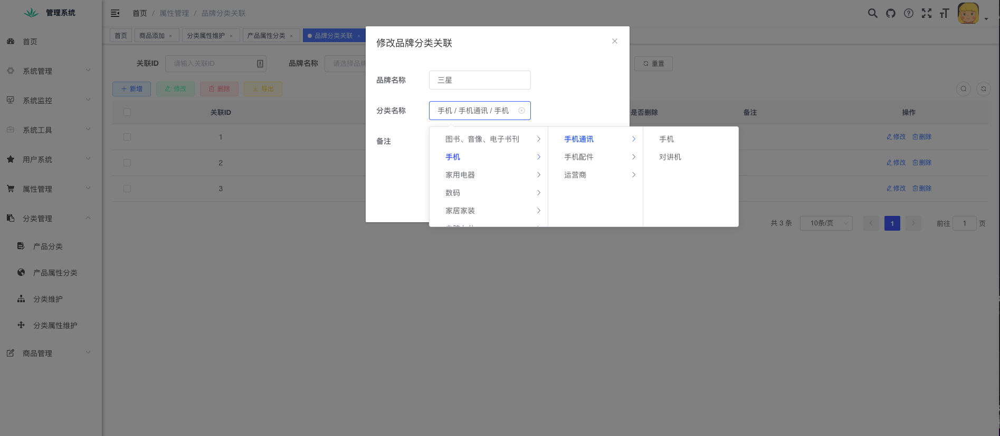
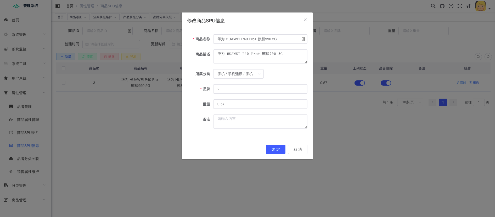
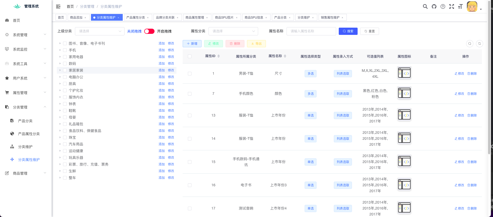
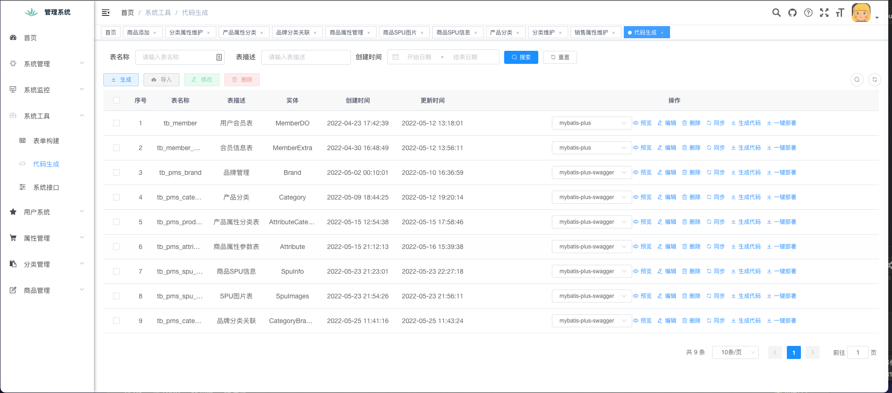

## 基于若依的个人项目魔改

## 更新说明

### 2022/05/29

商品新增 步骤图

### 2022/05/26

商品属性组关联

### 2022/05/23

品牌分类关联。内部嵌套

### 2022/05/20

SPU 信息维护，属性的分类维护

### 2022/05/15

分类树形列表管理 拖拽

### 2022/05/13

OssClient集成 文件上传本地->云服务器 支持获取签名后上传

### 2022/05/12

增加代码生成类型

### 2022/05/09

增加一键部署功能。可直接生成指定位置代码，避免拷贝粘贴。以及失败后续处理。

### 2022/05/08

基于mybatis-plus 个人迭代更新 代码生成模版增加筛选

